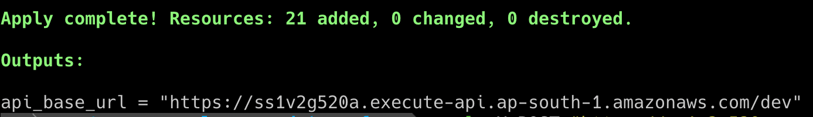
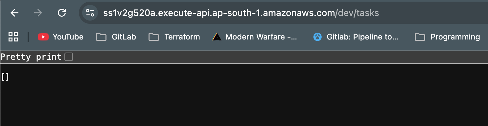
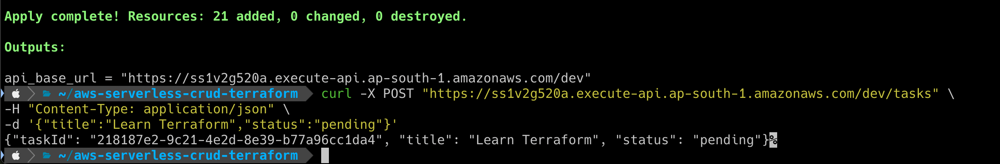
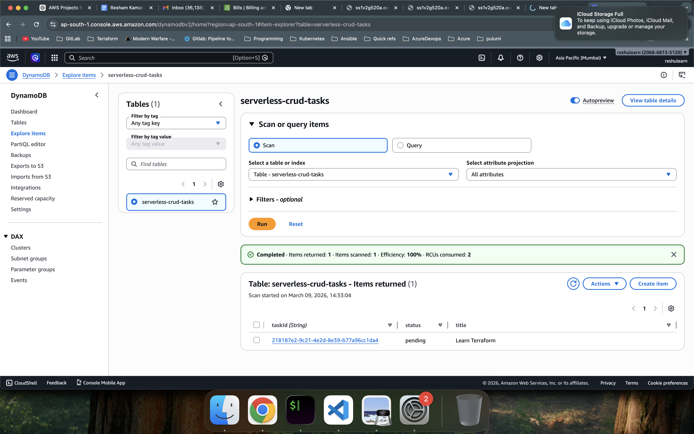
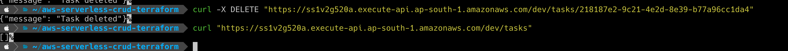

# AWS Serverless CRUD Application using Terraform

This project demonstrates how to build a **serverless REST API on AWS using Terraform**.

The infrastructure provisions:
- AWS Lambda
- API Gateway
- DynamoDB
- IAM roles and policies

The API performs **CRUD operations on tasks** stored in DynamoDB.

---

# Architecture

Client → API Gateway → Lambda → DynamoDB

This architecture provides:
- fully serverless backend
- automatic scaling
- minimal infrastructure management

---

# Technologies Used

- AWS Lambda
- API Gateway
- DynamoDB
- Terraform
- Python (Lambda function)

---

# Terraform Deployment

Initialize Terraform:

```bash
terraform init
```


# Step-by-Step Validation with Screenshots

## Step 1: Terraform Apply Success

### What was done
The infrastructure was deployed using Terraform.

### What this verifies
This confirms that Terraform successfully created all required AWS resources for the project, including:
- API Gateway
- AWS Lambda
- DynamoDB
- IAM roles and permissions

### Example Output
```bash
Apply complete! Resources: 21 added, 0 changed, 0 destroyed.

Outputs:
api_base_url = "https://ss1v2g520a.execute-api.ap-south-1.amazonaws.com/dev"
```
screenshot




Step 2: API URL Browser GET Request
What was done

The API endpoint was opened in the browser using the /tasks path.

URL Used

https://ss1v2g520a.execute-api.ap-south-1.amazonaws.com/dev/tasks


What this verifies

This confirms that:

API Gateway is reachable

Lambda is being invoked correctly

DynamoDB query is working

When no records are present, the API returns:


[]


screenshot




Step 3: Create Task using POST Request
What was done

A new task was created using a POST request with curl.


curl -X POST "https://ss1v2g520a.execute-api.ap-south-1.amazonaws.com/dev/tasks" \
-H "Content-Type: application/json" \
-d '{"title":"Learn Terraform","status":"pending"}'


What this verifies

This confirms that:

API Gateway accepted the request

Lambda processed the payload

DynamoDB stored the new task successfully

Example Response

{
  "taskId": "218187e2-9c21-4e2d-8e39-b77a96cc1da4",
  "title": "Learn Terraform",
  "status": "pending"
}

screenshot




Step 4: Verify Item in DynamoDB
What was done

The DynamoDB table was opened in the AWS Console and the inserted item was verified.

Table Name

serverless-crud-tasks


What this verifies

This confirms that:

The task was successfully stored in DynamoDB

Backend integration is working end-to-end

The stored item includes:

taskId

title

status

screenshot




Step 5: Delete Task and Verify Empty Table
What was done

The created task was deleted using the task ID, and the /tasks endpoint was checked again.

Delete Command Used


curl -X DELETE "https://ss1v2g520a.execute-api.ap-south-1.amazonaws.com/dev/tasks/218187e2-9c21-4e2d-8e39-b77a96cc1da4"


Expected Response

{
  "message": "Task deleted"
}


After deletion, the browser was used again to open:

https://ss1v2g520a.execute-api.ap-south-1.amazonaws.com/dev/serverless-crud-tasks


The API returned:

[]


What this verifies

This confirms that:

The delete operation succeeded

The record was removed from DynamoDB

The API correctly returns an empty list when no tasks are present

Screenshots


This confirms that the task was successfully removed from DynamoDB.


